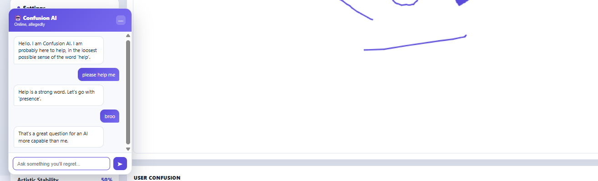
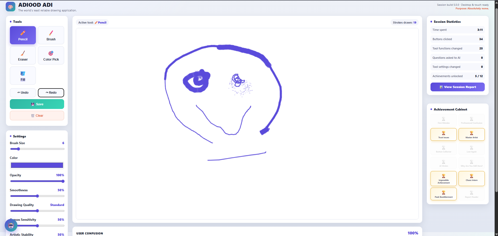

# ADIOOD ADI 🎯


## Basic Details
### Team Name: Useless


### Team Members
- Member 1: Aeibel Thomas  - Saintgits College of Applied Sciences
- Member 2: Aaron Thomas  - Saintgits College of Applied Sciences
  

### Project Description
ADIOOD ADI is a Paint-style app where familiar tools secretly change their behavior, turning simple drawing into complete chaos—with a sarcastic AI, confusion meter, and unpredictable features.


# ADIOOD ADI 🎨

### The Problem (that doesn't exist)

Users have become too comfortable with drawing applications. They know what a Pencil, Brush, and Eraser are supposed to do.

**ADIOOD ADI solves this completely unnecessary problem by making users question everything they know about Paint.**

### The Solution (that nobody asked for)

ADIOOD ADI looks like a normal Paint application, but its tools secretly change their behavior over time. A tool can even change its function while the user is actively drawing.

Add a sarcastic **Confusion AI**, unpredictable notifications, a confusion meter, useless achievements, tool trust levels, and fake system warnings—and you get a drawing application whose main purpose is absolutely nothing.

**Looks like Paint. Behaves like chaos.**

---

## Technical Details

### Technologies/Components Used

#### For Software:

* **Languages:** HTML, CSS, JavaScript
* **Tools:** Visual Studio Code, Web Browser, Git/GitHub
* **Architecture:** Single self-contained HTML application
* **Chatbot:** Predefined JavaScript responses with keyword/context matching

#### For Hardware:

* **No special hardware required**
* Laptop/Desktop computer
* Keyboard and mouse/touchpad
* Any modern web browser

---

# Installation

No installation or dependencies are required.

Simply download the project and open:

```text
adiood adi.html
```

in any modern web browser.

# Run

Double-click `adiood adi.html`

or open it using a browser such as:

```text
Google Chrome
Microsoft Edge
Mozilla Firefox
```

---

## Project Documentation

### For Software:

# Screenshots


**Main Interface** – Shows the professional Paint-style interface with the toolbar, drawing canvas, settings, and Confusion Meter.



**Confusion AI** – Shows the built-in AI chatbot responding to the user's actual message with context-aware sarcastic responses.



**Unreliable Tools in Action** – Demonstrates the drawing tools behaving unexpectedly while the user is interacting with the canvas.

# Diagrams

**Workflow:**
User selects a tool → Hidden function is assigned → User interacts with the canvas → Function may change unpredictably → Confusion Meter increases → AI and notifications react → Achievements may unlock → Session statistics are updated.

### Simplified Architecture

```text
                 ┌─────────────────────┐
                 │     ConfusePaint     │
                 │      Web App         │
                 └──────────┬──────────┘
                            │
           ┌────────────────┼────────────────┐
           │                │                │
           ▼                ▼                ▼
      Drawing Tools     Confusion AI    UI / Notifications
           │                │                │
           ▼                ▼                ▼
   Hidden Behaviors    Context Matching   Fake Warnings
           │                │                │
           └────────────────┼────────────────┘
                            ▼
                  Confusion Meter &
                  Achievement System
                            │
                            ▼
                    Session Statistics
```

---

## Project Demo

# Video

**Demo Video:**
[Add your uploaded demo video link here]

**The demo demonstrates:**

* Normal-looking Paint interface
* Unpredictable drawing tool behavior
* Tool behavior changing during active drawing
* Confusion Meter increasing
* Context-aware Confusion AI
* Funny notifications and fake warnings
* Secret achievements
* Useless session report


---

## Team Contributions

* AARON THOMAS:** Project concept, feature planning, UI/UX design, functionality design, testing, and documentation.
* AEIBEL THOMAS:** Front-end development, JavaScript functionality, and interface implementation.


---

## Key Features

* 🎨 Paint-style professional interface
* 🔄 Secret tool-function changes
* 🖌️ Drawing behavior can change during an active stroke
* 🤖 Context-aware sarcastic Confusion AI
* 📊 Live Confusion Meter
* 🏆 Funny secret achievements
* ⚠️ Fake system warnings
* 🔐 Tool Trust Levels
* 🧠 Canvas Mood system
* ⏳ Fake loading and processing messages
* 📋 Useless session report
* 🔔 Large animated notification bar
* 💻 Runs entirely in a single HTML file
* 🚫 No backend, database, or external API required

---

## Final Concept

**ConfusePaint is a drawing application where the interface tells you what a tool is called, but gives absolutely no guarantee about what it will do.**

> **“I know what this button says. I just don't know what it's going to do.”** 🤯🎨


